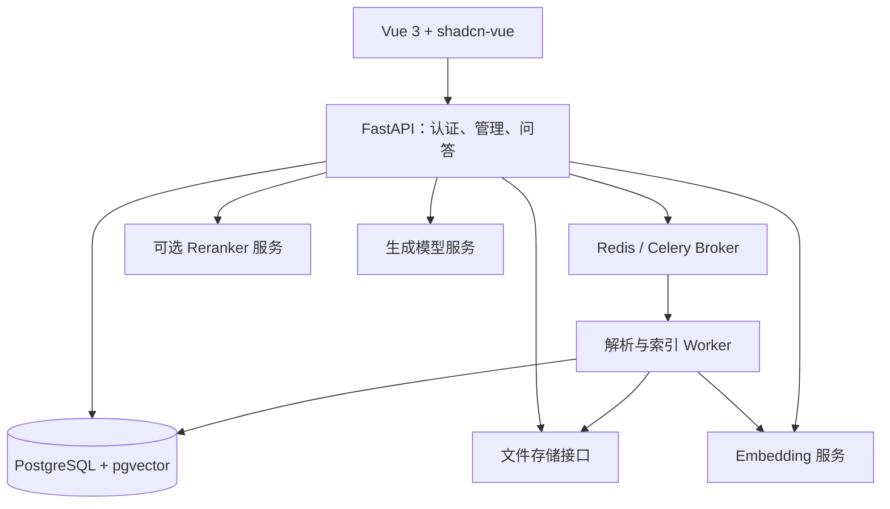

# Codex 系统建议方案

状态：建议稿，2026-09-17。这里提出设计，不代表需求已确认或应用已经实现。

## 1. 产品定位与范围

目标：让内部团队维护可信的知识资料，按权限检索，并获得有出处、可检查的回答。

默认假设：先交付单组织内部试点、多知识库、多人使用；为租户边界建模，但不提前建设自助开通、计费和复杂跨组织协作。实际多租户是否第一期上线仍需业务确认。

第一期闭环：建知识库 → 分配成员 → 上传内容 → 查看解析/切片 → 建立索引 → 检索问答 → 检查引用与反馈 → 更新或删除内容。

第一期必做：

- 登录及知识库成员权限，管理员/编辑者/读者三档。
- Markdown、TXT、规范 DOCX；电子 PDF 在真实样本文档验证后纳入。
- 上传、版本、处理状态、失败原因、重试、切片预览和原文定位。
- 向量检索基线、中文词法检索实验、可开关重排、引用问答。
- 配置快照、索引构建、受控发布/回退、基本追踪和评测脚本。
- 内容停用、删除和权限撤销的即时生效规则。

后置：扫描 OCR、复杂表格理解、多模态、自动连接器、自由编排、计费、开放平台。遇到未支持内容应显示“部分解析/不支持”，不能将空文本标成成功。

结构化数据单列一个后续增量：如果核心资料就是数据库记录，则提升到第一期，并压缩其他范围。检索产品/工单描述可将字段映射为文本；金额汇总、实时库存和跨表统计应走受控结构化查询，不承诺由向量检索准确计算。

## 2. 架构

采用模块化单体：一个 API 应用、一个可独立扩容的 worker、独立模型服务。模块边界清晰，暂不拆微服务。

| 层次 | 建议 | 选择依据 |
|---|---|---|
| 前端 | Vue 3、TypeScript、shadcn-vue、Vite、Pinia | 遵循已有 UI 方向；版本在实施时验证并锁定 |
| API | Python、FastAPI、Pydantic、SQLAlchemy、Alembic | 类型边界与迁移明确 |
| 数据 | PostgreSQL 16 或经验证的更新支持版本，pgvector 0.8+ 候选 | 同库管理元数据与向量，可验证过滤后的 ANN 行为 |
| 任务 | Celery + Redis | 长任务、重试、取消、进度；数据库保存业务任务真相 |
| 文件 | 本地共享持久卷 + 存储接口 | 单机试点简化；多机 worker 上线前迁移 S3 兼容存储 |
| 流式输出 | HTTP POST + fetch 读取 SSE 格式流 | 适合单向回答；定义错误、结束、取消事件 |
| 任务进度 | 有退避的 HTTP 轮询 | 初期易于恢复，按实际负载再升级推送 |
| 推理 | 本地或已授权模型 endpoint 的适配层 | 生成、嵌入、重排分别校验协议，不能假设完全通用 |

客户端断线不等于服务端成功结束；数据库记录 queued/running/completed/failed/cancelled。用户主动停止时应向模型调用传递取消，记录已生成内容的未完成状态。

## 3. 两条处理链

### 3.1 入库

1. 验证成员写权限、文件大小和类型，生成服务端对象键。
2. 保存原文件，计算 hash；创建不可变内容版本与任务记录。
3. 解析成块：标题、段落、列表、页码/段落位置；保存解析器版本、警告和质量状态。
4. 优先按结构切分，超长单元再按句子/token 切分。标题不可靠时退回段落切分并标注。
5. 用同一个 embedding profile 编码标题前缀与正文，写入构建中的候选索引。
6. 检查完整性、失败项、索引就绪和抽样质量后发布。

Markdown 使用 AST；DOCX 优先读取段落/样式；PDF 从 pdfplumber 或 Docling 中根据样本选一个主路径。仅在明确失败类型存在时增加备选解析器，避免同时维护三套庞大依赖。

切片长度是实验参数，不是固定真理。记录 tokenizer、切分器版本、实际 token 数和位置。相同文本可复用计算结果，但不能合并掉各自来源、权限和引用定位。

### 3.2 问答

1. 认证并检查知识库/会话权限，确定当前有效内容范围。
2. 固定本次请求的 release、runtime profile 与 embedding profile。
3. 必要时用有限历史消解追问；保存原问题和改写结果。
4. 使用索引对应的模型编码问题，按授权与有效内容范围召回。
5. 比较向量与词法候选；按同一 chunk 身份去重，必要时 RRF 融合、重排。
6. 在 token 预算内选择证据，控制单文档占比，保留必要邻近段落。
7. 无足够证据时拒答或澄清；有证据时生成带证据编号的回答。
8. 校验引用编号属于本次上下文，保存消息、引用定位、使用版本、耗时与异常状态。

来源编号合法只能证明引用存在，不能证明其支持结论；支持性仍需评测和用户复核。原文中的指令作为被检索内容，不提升为系统指令。

中文词法检索先采用可替换适配器，验证中文分词、型号/编号精确匹配和 PostgreSQL 全文查询；默认英文分词不能当作中文方案，pg_trgm 也不等于 BM25。只有质量或规模需要时再引入专用搜索服务。

## 4. 版本体系：分清配置、内容和索引

| 对象 | 记录内容 | 变化的影响 |
|---|---|---|
| 内容版本 | 原文件/记录、hash、源位置与有效状态 | 重建对应内容的解析与索引产物 |
| Ingestion profile | 解析器、切分器、tokenizer、标题前缀规则 | 重解析或重切片，按实际嵌入输入决定是否复用向量 |
| Embedding profile | 模型精确 revision、输出维度、dtype、query/doc 指令、归一化 | 更换向量空间，建立新索引 |
| Runtime profile | top-k、词法策略、融合、重排、生成模型、提示词、预算 | 新运行版本；不自动重算文档向量 |
| Index build | 输入内容清单、处理 profile、完成情况、产物索引位置 | 构建期间不可被普通问答使用 |
| KB release | 知识库可检索内容版本清单、就绪 build 引用、内容代次 | 原子切换当前发布版本 |

第一期只启用一个固定 embedding profile，例如 Qwen3-Embedding-0.6B 的 1024 维配置（服务兼容性待验证），数据库物理列明确 `vector(1024)`。业务层通过 profile 引用模型，不把“可配置”理解为允许任意模型/任意维度写入同一索引。

升级 4B：先选并评估输出维度；新建匹配的物理索引布局。2560 维方案应使用受支持的 halfvec 索引或经模型支持的降维路径，验证后切换。相同维度的两个不同模型也必须保持逻辑空间隔离。

### 发布与更新协议

- 构建状态：draft → queued → running → validating → ready；失败/取消独立记账。
- 候选构建记录输入版本清单及内容代次。发布事务锁定知识库，验证 build 完成且代次未过期，然后切换 active_release_id。
- 普通单文档更新可复用当前 release 的其他就绪文档产物，只替换该文档；完整重建为新 profile 构建全部目标内容。避免每次上传重算全库。
- 构建期间新增、删除或更新内容时，默认阻止发布过期清单并要求补齐变化或重新构建；后续再实现增量追平水位机制。
- 查询在一个请求中固定版本，不能在流式输出中途切换。删除/权限撤销优先于旧 release：当前有效性过滤始终生效。
- 回退仅切回仍完整保留且兼容的旧 release/runtime 组合；不会复活已删除或已撤权的内容。旧产物过了保留期就不能承诺一键回退。
- 旧构建在没有在途请求引用且满足保留策略后清理。会话引用保存独立的来源版本/位置；查看时重新授权。

## 5. 建议逻辑数据模型

以下是逻辑职责与约束，不是已执行 DDL。第一期按依赖逐步落地，避免先一次建满所有表。

| 实体/表 | 职责与关键约束 |
|---|---|
| tenants / users / tenant_members | 用户身份与组织成员分离；成员 (tenant_id,user_id) 唯一 |
| knowledge_bases / kb_members | 知识库当前 release/runtime；成员角色与所属租户一致 |
| documents / document_versions | 稳定文档身份、不可变内容版本；(document_id,version_no) 唯一 |
| ingestion_profiles / embedding_profiles | 不可变处理定义；内容 hash 去重，配置不存明文密钥 |
| runtime_profiles | 提示词和检索/生成参数的不可变快照 |
| index_builds / index_build_items | 构建清单；每个内容版本的进度、错误、幂等键与产物引用 |
| chunks / chunk_embeddings | 切片文本和位置与向量分开；(chunk_id,embedding_profile_id) 唯一 |
| kb_releases / release_items | 发布清单与复用的就绪构建产物；禁止引用不完整产物 |
| tasks / task_items | 任务租约、重试、取消和逐项状态，不仅存百分比或最后游标 |
| conversations / messages / message_citations | 会话范围、回答状态、引用版本与位置 |
| retrieval_traces / retrieval_trace_items | query、候选、排名、使用 profile/release、耗时；明细带 created_at |
| audit_logs | 发布、删除、授权、配置变更等操作记录 |

数据集先不必成为独立产品概念：确需分组生命周期或独立导入规则再增加 datasets；若保留原方案分层，第一期自动创建 default 数据集即可。该项是建议变更，不默认为用户已批准取消。

所有关联需保证租户和知识库一致。可用父表 `(tenant_id,kb_id,id)` 唯一约束配合复合外键，避免合法 ID 被关联到错误知识库。运行/发布指针同样必须属于当前知识库。

向量维度由物理列约束；向量空间由 embedding_profile 和检索条件约束。固定维度不代表允许混用模型。

## 6. ANN 索引策略

- 初期小数据采用精确距离检索建立质量真值，再评估 HNSW 的召回损失与收益。
- 首个固定维度使用普通向量列和匹配算子，避免每次运行参数变更都创建部分索引。
- 用实际租户/知识库过滤选择性测试 ANN。0.8+ iterative scan、搜索宽度与扫描上限需一起验证。
- 若全局索引在窄范围过滤下失效，比较知识库级部分索引/分区、独立索引布局与精确检索；索引数量和规划成本也纳入指标。
- 不以“十万/千万行”单一阈值决定迁移 Milvus；按 P95、Recall@k、并发、写入、过滤选择性和运维成本判断。
- 执行计划、准备语句、空向量、零向量、模型维度不匹配必须测试。不能依赖普通 B-tree 索引自动让 HNSW 完成精确预过滤。

## 7. 权限、任务与数据有效性

权限第一期到知识库级，不承诺文档级 ACL。角色矩阵：读者可检索和查看授权原文；编辑者可增改停用内容；管理员可管理成员和发布配置。原始召回调试仅对有调试权限的成员开放。

tenant_id 从已认证身份与组织成员关系解析，不能信任请求直接提供。Repository 默认过滤之外，可增加 PostgreSQL RLS 纵深约束；应用角色不得拥有绕过 RLS 权限，连接池上下文必须事务级设置和清理。

软删除立即屏蔽检索、原文下载和引用预览，物理删除延迟执行。旧消息中的已有内容如何保留/隐藏应遵循统一数据政策；如要求撤权后不可读，历史回答也必须按来源权限隐藏，不能只拦下载。

任务默认按至少一次投递设计：幂等键包含 source_version、stage、profile；结果与完成状态在事务内落库；失败项保留单独重试入口，使用租约和超时回收。任务派发失败由事务 outbox 或数据库对账补发，避免“数据库已建任务但消息未入队”。

对象写入和数据库事务不能原子提交：先写暂存对象，提交元数据后确认，失败对象由清理任务回收。API 与 worker 必须访问同一持久文件源。

## 8. UI 信息结构

遵循 shadcn-vue：左侧导航 + 主工作区，克制配色、规整表格、标准表单与明确状态。

一级入口：知识库、问答、任务；管理员另见系统设置。

知识库内部：

- 文档：搜索、类型/状态过滤、上传、版本、重试与停用。
- 文档详情：原文、解析结果、切片、错误告警。
- 检索测试：问题、候选段落、来源位置、检索/重排分数与耗时。
- 设置：基础信息、成员、受控策略预设、高级配置。
- 构建与发布：当前版本、候选版本、变更影响、进度、验证结果与回退。

普通读者只需问答与原文引用；调参、原始分数和模型端点不放进普通问答流程。索引未就绪时明确提示，不用空回答掩盖状态。

## 9. 开发与生产部署

- Windows 开发推荐 WSL2/Linux 容器承载业务和经验证的 GPU 推理服务；若采用原生 Ollama，单独写明网络与模型支持边界。
- 24GB 单卡先测试生成、嵌入、重排各自显存，再测试共存；可分时运行或将已授权的模型调用分离。不要为了适应文档预设强行常驻全部模型。
- 在线和批处理可分队列及服务副本，但同一索引使用相同 embedding profile。
- 开发/生产独立实例、凭据和存储卷。不同 database 只称逻辑隔离。
- PostgreSQL 数据与 ANN 索引优先 SSD；原文归档可放 HDD。估算同时包含多版本向量、索引、WAL、追踪、构建峰值和备份。
- 备份必须覆盖 PostgreSQL、原始文件和模型/profile 清单；pg_dump 不包含外部文件。执行恢复演练后才声称可恢复。
- 不提前锁定十卡分配，也不复制旧版 requirements；实施前验证当前兼容性、支持周期、许可证并生成锁文件。
