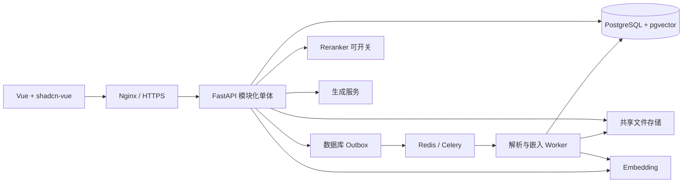

# 产品范围与技术架构

## 1. 用户价值与交付版本

用户能维护自己的业务资料，用自然语言查找知识，并定位回答所依据的原文。管理员能解释“为什么搜到/没搜到”，知道内容是否已生效，安全地更新配置和回退发布。

| 版本 | 范围 | 完成标志 |
|---|---|---|
| V0 技术验证 | 真实资料、结构切片、精确向量检索、回答引用、评测脚本 | 证据链成立，失败可归因 |
| V1.0 内部版 | 身份与知识库权限、文档版本、异步处理、发布、检索、流式问答、评测和恢复 | P01–P27 全部通过 |
| V1.1 记录接入 | JSON/CSV 规范记录导入、字段映射、增量更新/删除、记录引用 | P28–P30 通过 |
| 后续 | OCR/复杂表格、外部连接器、文档 ACL、跨库问答、开放 API、SaaS | 分别做需求和容量评估 |

V1.0 支持 Markdown、TXT、DOCX、电子 PDF。Markdown/TXT 为确定路径；DOCX/PDF 需要代表性样本验证。PDF 扫描页、复杂表格、损坏文件不能静默跳过后标为完整可用。

不包含自由 Agent 执行、任意 SQL、代码运行和自动操作业务系统。生成的答案不直接触发外部动作。

## 2. 角色与权限

| 行为 | 读者 | 编辑者 | 知识库管理员 | 组织管理员 |
|---|---|---|---|---|
| 查看已发布资料、提问、查看本人会话 | ✓ | ✓ | ✓ | 需有显式知识库权限 |
| 上传、查看草稿、重试、停用内容 | — | ✓ | ✓ | 同上 |
| 物理删除申请、发布/回退、检索调试 | — | — | ✓ | 同上 |
| 成员、运行配置、索引配置管理 | — | — | ✓ | 同上 |
| 组织账号管理、创建知识库、模型端点登记 | — | — | — | ✓ |

组织管理员通过可审计的授权流程获得知识库权限，不隐式读取全部资料。知识库创建者默认成为该库管理员。会话默认仅创建者可读；排障追踪不等于拥有他人会话阅读权限。

## 3. 架构与模块



| 模块 | 职责 | 禁止越界 |
|---|---|---|
| identity | 会话认证、组织和知识库授权 | 不信任客户端 tenant_id |
| knowledge | 知识库、成员、数据集 | 不直接操作推理服务 |
| content | 文件/版本、原文定位、有效状态 | 不原地覆盖旧内容版本 |
| ingestion | 解析、切分、嵌入、质量检查 | 不发布半成品 |
| indexing | 构建、清单、发布、回退 | 不混用模型空间 |
| retrieval | 权限范围、词法/向量候选、融合/重排 | 不靠生成 Prompt 实现权限 |
| conversation | 流式回答、引用、会话状态 | 不把流式中断标记成功 |
| evaluation | 数据集、运行快照、人工评分 | 不用调参集冒充留出集 |
| operations | 任务补偿、清理、审计、恢复 | 不随意清理仍被引用的产物 |

## 4. 技术选型与版本管理

| 领域 | 固定方向 | 实施规则 |
|---|---|---|
| 前端 | Vue 3、TS、Vite、shadcn-vue、Tailwind、Vue Router、Pinia | Composition API、script setup；采用安装时验证兼容的版本组合 |
| 后端 | Python 3.11/3.12 兼容候选、FastAPI、Pydantic 2、SQLAlchemy 2、Alembic、asyncpg | P02 锁定一个 Python minor 版本，不能两套混用 |
| 数据 | PostgreSQL 16、pgvector 0.8+ 受支持补丁版本 | 固定镜像 digest；数据库扩展版本与 Python 客户端版本分别登记 |
| 任务 | Celery 5、Redis 受维护且符合部署许可的版本 | 明确锁版本，任务数据以 PostgreSQL 为准 |
| 认证 | 服务端 session、Argon2id 密码哈希 | HttpOnly/Secure/SameSite cookie，写请求校验 CSRF 与 Origin |
| 流式输出 | POST 请求 + fetch 消费 SSE 格式流 | 同源 cookie，服务端明确结束/错误/取消 |
| 文件 | 开发/单机使用共享持久卷，Storage 接口 | 多机前切换 S3 兼容存储；备份覆盖原文件 |
| 解析 | markdown-it-py、TXT 编码检测、python-docx、PDF 主解析器 | PDF 在 pdfplumber/Docling 中用样本选定，另一条按失败类型引入 |
| 测试 | pytest、Vitest、Vue Test Utils、Playwright | 测业务行为，不只测实现细节 |

不把旧文档的 requirements 当锁文件。P02 产出 uv.lock/等效后端锁、pnpm-lock.yaml、镜像清单、许可证检查记录；从干净环境安装验证。

## 5. 模型部署策略

默认嵌入候选：Qwen3-Embedding-0.6B、1024 维。模型精确 revision、tokenizer、query instruction、doc 格式、归一化和截断规则属于不可变 embedding profile。

重排候选：Qwen3-Reranker-0.6B，默认关闭，P20 按证据开启。生成模型默认先验证现有本地指令模型；旧文档“27.3B”缺少准确标识，不能据此生成启动命令。若它无法在目标设备稳定运行，选一个能满足质量目标的较小本地指令模型。

推理框架优先验证 Linux/WSL2 的 vLLM 或兼容服务；TEI 的具体模型支持与接口单独验证；Windows 原生 Ollama 是另一种可验证部署路径，不与 vLLM 混为一谈。

单 24GB GPU 先逐服务测试，再验证共存。初始在线生成并发为 1、后台嵌入并发为 1，并通过调度避免未验证的同时峰值。若无法共存，明确采用分时构建窗口、单独设备或更小生成模型。不会默认采购或依赖未来十卡服务器。

4B 升级是独立构建实验：选定输出维度或 halfvec 物理布局，文档和查询使用同一模型空间，评测后发布。维度相同也不允许新旧模型混查。

## 6. 首版可调默认值

以下是启动配置，不是性能保证，P08/P20 调整后保存版本。

| 参数 | 起始值 | 限制 |
|---|---|---|
| 单文件大小 | 50 MiB | 服务端和网关一致，按实际资料可调整 |
| PDF 页数 | 500 页 | 超限拒绝或走管理员批处理 |
| chunk 目标/最大 | 512/800 tokens | 按嵌入 tokenizer，标题前缀也计入 |
| 超长段重叠 | 64 tokens | 仅同节二次切分，不跨不相关章节 |
| 向量/词法候选 | 各 30 | 授权和有效性条件一致 |
| RRF k / 权重 | 60 / 两路等权 | 在留出集测试，不强制使用融合 |
| 重排候选/最终证据 | 最多 40 / 最多 6 | 上下文预算可能进一步缩小 |
| 生成输出上限 | 1024 tokens | 可配置，完整回答时间另测 |
| 输入证据预算 | 6000 tokens 起点 | 必须小于模型窗口减历史、系统和输出预算 |
| 任务状态轮询 | 2s 逐步退避到 10s | 离开页面取消；失败提供重试 |
| 暂态错误重试 | 最多 3 次指数退避+抖动 | 格式错误、权限拒绝、维度错误不自动重试 |
| 追踪明细/审计 | 30 天 / 180 天 | 容量与数据政策复核后可改 |
| 可回退 release | 最近 2 个且最长 7 天 | 删除/撤权始终优先，不承诺过期回退 |

## 7. 工程目录与环境

```text
backend/app/
  api/v1/  core/  db/  modules/
  rag/parsing/  rag/chunking/  rag/embedding/
  rag/retrieval/  rag/reranking/  rag/generation/
  jobs/  storage/
backend/tests/
frontend/src/
  app/  layouts/  pages/  features/  components/ui/
  composables/  stores/  api/
infra/compose/  infra/nginx/  infra/scripts/
eval/datasets/  eval/runs/
docs/adr/  docs/runbooks/
```

dev/test/prod 使用独立数据库实例、凭据、文件卷、Redis namespace/实例和备份目标。生产只暴露 HTTPS，数据库、Redis、模型端口限内部网络。WSL2 服务文件放 Linux 文件系统以减少跨文件系统 IO，代码协作方式在 P02 固定。

## 8. 可行性闸门

P03 无可用模型端点：优先解决模型服务，不继续增加界面。P08 证据召回差：先修解析/切分，不建设复杂融合。P25 性能差：先定位排队、ANN 过滤、模型内存与吞吐，不直接更换数据库。P26 恢复失败：不进入生产。
